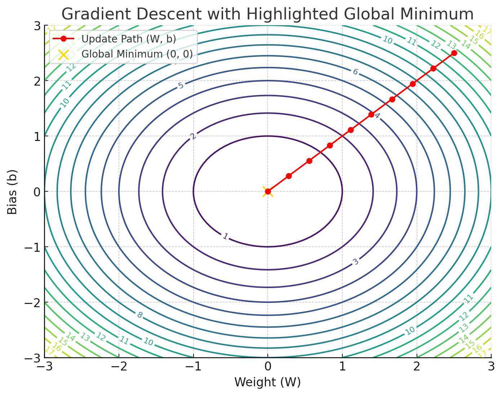

# Gradient Descent

## Gradient Descent Overview

Gradient Descent is an optimization algorithm used to minimize the loss function by iteratively updating the model’s parameters (weights and biases). It works by moving in the opposite direction of the gradient of the loss function with respect to the parameters.

---

## Steps in Gradient Descent

1. **Initialize Parameters**:
   - Start with initial values for weights \( W \) and bias \( b \) (e.g., small random values).

2. **Compute the Loss**:
   - Calculate the loss function (e.g., log-loss for logistic regression):
     \[
     J(W) = -\frac{1}{m} \sum_{i=1}^m \Big[ y^{(i)} \log(h_\theta(x^{(i)})) + (1 - y^{(i)}) \log(1 - h_\theta(x^{(i)})) \Big]
     \]
     where \( h_\theta(x) = \sigma(Wx + b) \).

3. **Compute the Gradients**:
   - Use the chain rule to compute the partial derivatives of the loss function with respect to \( W \) and \( b \):
     - For weight \( W \):
       \[
       \frac{\partial J}{\partial W} = \frac{1}{m} \sum_{i=1}^m (h_\theta(x^{(i)}) - y^{(i)}) x^{(i)}
       \]
     - For bias \( b \):
       \[
       \frac{\partial J}{\partial b} = \frac{1}{m} \sum_{i=1}^m (h_\theta(x^{(i)}) - y^{(i)})
       \]

4. **Update Parameters**:
   - Update \( W \) and \( b \) using the gradients and a learning rate \( \alpha \):
     \[
     W := W - \alpha \frac{\partial J}{\partial W}, \quad b := b - \alpha \frac{\partial J}{\partial b}.
     \]

5. **Repeat**:
   - Perform steps 2 to 4 for a set number of iterations or until convergence.

---

## Key Properties of Gradient Descent

1. **Learning Rate (\( \alpha \))**:
   - Determines the step size during updates.
   - If \( \alpha \) is too large, it can overshoot the minimum.
   - If \( \alpha \) is too small, convergence is very slow.

2. **Convergence**:
   - For convex loss functions (e.g., log-loss), gradient descent ensures convergence to the global minimum.

3. **Global Minimum**:
   - The log-loss for logistic regression is convex, so there is only one global minimum.

---

## Full Derivation of Partial Derivative of Log-Loss with Respect to W

The log-loss function for a single training example \((x, y)\) is:
\[
J(W, b) = - \Big[ y \log(h_\theta(x)) + (1 - y) \log(1 - h_\theta(x)) \Big],
\]
where:
\[
 h_\theta(x) = \sigma(z) = \frac{1}{1 + e^{-z}} \quad \text{and} \quad z = Wx + b.
\]

### Chain Rule for Partial Derivative
To compute \( \frac{\partial J}{\partial W} \):
\[
\frac{\partial J}{\partial W} = \frac{\partial J}{\partial h_\theta} \cdot \frac{\partial h_\theta}{\partial z} \cdot \frac{\partial z}{\partial W}.
\]

### Step-by-Step Derivation:

1. **First Term: \( \frac{\partial J}{\partial h_\theta} \)**
   Differentiating log-loss with respect to \( h_\theta \):
   \[
   \frac{\partial J}{\partial h_\theta} = - \left[ \frac{y}{h_\theta} - \frac{1 - y}{1 - h_\theta} \right].
   \]

2. **Second Term: \( \frac{\partial h_\theta}{\partial z} \)**
   The [derivative of the sigmoid function](https://math.stackexchange.com/questions/78575/derivative-of-sigmoid-function-sigma-x-frac11e-x) is:
   \[
   \frac{\partial h_\theta}{\partial z} = h_\theta (1 - h_\theta).
   \]

3. **Third Term: \( \frac{\partial z}{\partial W} \)**
   Since \( z = Wx + b \), the derivative with respect to \( W \) is:
   \[
   \frac{\partial z}{\partial W} = x.
   \]

### Combine All Terms:
Substitute into the chain rule:
\[
\frac{\partial J}{\partial W} = - \left[ \frac{y}{h_\theta} - \frac{1 - y}{1 - h_\theta} \right] \cdot h_\theta (1 - h_\theta) \cdot x
\]

### Simplification:
- The combination of log-loss and sigmoid **absorbs** the term \( h_\theta (1 - h_\theta) \).
- Therefore, the gradient simplifies to:
\[
\frac{\partial J}{\partial W} = (h_\theta - y) x.
\]

#### Why \( h_\theta (1 - h_\theta) \) is "absorbed"
When we simplify the gradient further during gradient descent, the term 
\( h_\theta (1 - h_\theta) \) is naturally included because it arises directly from the sigmoid derivative.

---

## Gloal Minimum
The gradient of the log-loss with respect to weight \( W \) and \( b \) 

This result is computationally efficient and widely used in gradient descent for logistic regression.
