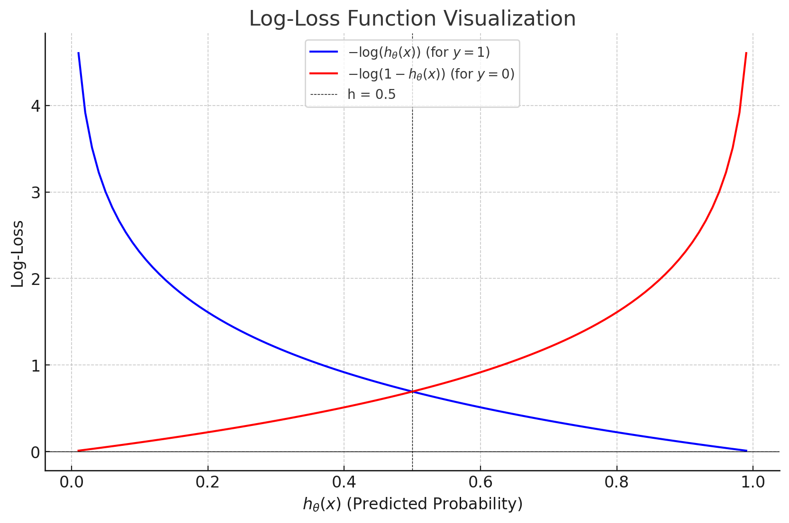

# Logistic Regression

## Introduction
Logistic regression is a statistical method used for binary classification problems for predicting the probability of a binary outcome (e.g., 0 or 1, yes or no).

---

## Key Concepts
### 1. **Linear Transformation**

A **linear transformation** is a fundamental operation in deep learning and forms the backbone of how neural networks process input data. It is expressed mathematically as:

\[
z = Wx + b
\]

Where:
- **\( W \)**: Weight matrix, which represents the parameters learned by the model.
- **\( x \)**: Input vector, representing the data passed into the layer.
- **\( b \)**: Bias vector, which helps shift the transformation and is also learned during training.
- **\( z \)**: Output vector (or pre-activation), the result of applying the linear transformation to the input.

**Abstract Concept: Mapping and Weights**
From an abstract perspective, matrix multiplication
\[
z = Wx + b
\] can be seen as a mapping process, where we take a set of inputs and map them to a new space. In the context of neural networks: 𝑊 acts as a mapping that transforms the input data into another space

---

### 2. **Sigmoid Function**
The sigmoid function is central to logistic regression. It maps any **real-valued** input to a range between 0 and 1, representing **probabilities**.

\[
\sigma(z) = \frac{1}{1 + e^{-z}}
\]

- **Input (z):** A linear combination of the input features:\(z = W^T x + B\)
- **Output (\(\sigma(z)\)):** Predicted probability \(P(y=1|x)\).

**Reference** The natrual log figure attached below:

---

### 3. **Log-Loss Function**
The log-loss function is the standard loss function for logistic regression. It measures how well the predicted probabilities align with the actual labels.

\[
J(\theta) = -\frac{1}{m} \sum_{i=1}^m \left[ y^{(i)} \log(h_\theta(x^{(i)})) + (1 - y^{(i)}) \log(1 - h_\theta(x^{(i)})) \right]
\]

- **\(h_\theta(x)\):** Predicted probability from the sigmoid function.
- **\(y^{(i)}\):** True label for the \(i\)-th training example.
- **\(-\frac{1}{m}\):** Averages the loss over all \(m\) training examples.

#### Explaination for Log-Loss Function

##### Step 1: Likelihood of Observed Data

For a single training example \((x, y)\), the likelihood of the observed output \(y\) is:

\[
P(y \mid x; \theta) = 
\begin{cases} 
h_\theta(x) & \text{if } y = 1 \\
1 - h_\theta(x) & \text{if } y = 0 
\end{cases}
\]

This can be written more compactly as:

\[
P(y \mid x; \theta) = [h_\theta(x)]^y \cdot [1 - h_\theta(x)]^{1-y}
\]

##### Step 2: Log-Likelihood for the Dataset

For \(m\) training examples, the total likelihood of the observed data is:

\[
L(\theta) = \prod_{i=1}^{m} P(y^{(i)} \mid x^{(i)}; \theta)
\]

Taking the logarithm (to simplify computations):

\[
\log L(\theta) = \sum_{i=1}^{m} \log P(y^{(i)} \mid x^{(i)}; \theta)
\]

##### Step 3: Negative Log-Likelihood (Log-Loss)

To minimize the loss, we take the negative log-likelihood (since maximizing likelihood is equivalent to minimizing its negative):

\[
J(\theta) = \sum_{i=1}^{m} \Big[ y^{(i)} \log \big(h_\theta(x^{(i)})\big) + \big(1 - y^{(i)}\big) \log \big(1 - h_\theta(x^{(i)})\big) \Big]
\]

##### Step 4: Averaging Loss
Average loss per training example by multiply \(-\frac{1}{m}\) instead of caculate total.

\[
J(\theta) = -\frac{1}{m} \sum_{i=1}^{m} \Big[ y^{(i)} \log \big(h_\theta(x^{(i)})\big) + \big(1 - y^{(i)}\big) \log \big(1 - h_\theta(x^{(i)})\big) \Big]
\]

**Reference** The Log-Loss function figure attached below:

---

### 4. Key Properties of Log-Loss Function

#### Probabilistic Grounding
- Log-loss aligns with maximum likelihood estimation (MLE), a standard statistical approach.

- It ensures the model predicts probabilities as close as possible to the true labels.

#### Penalizing Misclassifications
- Log-loss heavily penalizes confident but incorrect predictions.
  - If the model predicts \(h_\theta(x) = 0.99\) but the true label is \(y = 0\), the loss is very high.
  - This encourages the model to improve predictions where it is wrong.

#### Smooth and Convex
- Unlike squared error, log-loss is convex, ensuring a single global minimum.  
- This property allows gradient-based optimization methods (e.g., gradient descent) to reliably minimize the loss.

#### Works Well with Sigmoid
- The sigmoid function outputs probabilities in the range \(0 \leq h_\theta(x) \leq 1\).  
- Log-loss perfectly fits this probability output by rewarding correct probabilities and penalizing incorrect ones.

---

### 5. Comparsion of Cost Function
| Loss Function     | Description                                                          | Pros                                       | Cons                                |
| ----------------- | -------------------------------------------------------------------- | ------------------------------------------ | ----------------------------------- |
| **Log-Loss**      | Based on MLE; penalizes incorrect probabilities.                     | Probabilistic, convex, works with sigmoid. | Looks complex initially.            |
| **Squared Error** | Penalizes squared differences between \( y \) and \( h_\theta(x) \). | Simple and intuitive.                      | Non-convex for logistic regression. |
